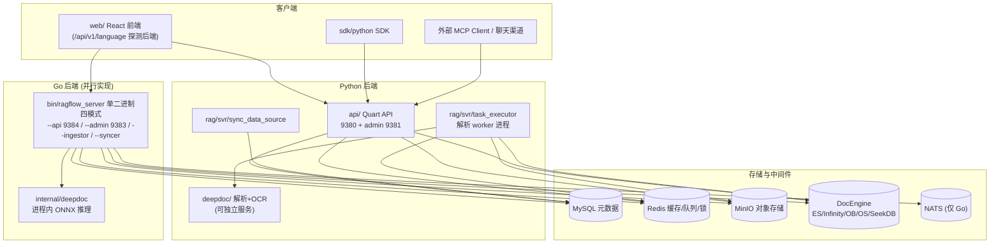

# RAGFlow Code Graph — Agent 项目导航文档

> **本文档是整个仓库的「代码地图」。任何 Agent 在分析、修改、评审本项目之前，必须先读本文档建立全局认知，再按需深入具体模块。**
> 最后更新：2026-09-01（基于 v0.27.1 代码结构）

---

## ⚠️ Agent 强制工作流（必读）

**以后对本项目做任何分析/修改，必须遵循以下流程，禁止跳过：**

1. **先读本文档** —— 用本文的「目录地图」和「核心数据流」定位任务涉及的模块，不要盲目全局搜索。
2. **用 code graph 方式阅读相关代码的整体脉络后再分析**：
   - 优先使用 `Explore` 子代理 / `grep_search` / `vscode_listCodeUsages`（符号引用图）/ `mcp_pylance_mcp_s_pylanceAnalyze`（Python 值溯源与调用流）等工具，沿调用链把「入口 → 中间层 → 落盘/出口」每一跳看清楚；
   - 对 Go 代码，沿 `router → handler → service → dao/engine` 分层追踪；对 Python 代码，沿 `apps → services → db/services → rag/utils` 追踪。
3. **确认双后端归属**：先判断任务属于 Python 路径还是 Go 路径（见「双后端机制」），两条路径是并行实现，改错一边不生效。
4. **最小范围验证**：改完只跑最窄的相关测试（见「命令速查」），不要默认全量。

---

## 1. 项目一句话

RAGFlow 是基于深度文档理解的开源 **RAG 引擎**：文档上传 → 深度解析（OCR/版面/表格）→ 分块 → 向量化 → 索引 → 混合检索 → LLM 问答，外加 Agent 画布工作流、聊天渠道、MCP 服务。

**关键事实：仓库内存在两套并行后端** —— Python（`api/` `rag/` `deepdoc/` `agent/`）与 Go（`cmd/` `internal/`），功能整体对齐重写，前端运行时探测后端身份。

## 2. 技术栈速览

| 层 | Python 路径 | Go 路径 |
|---|---|---|
| 语言/运行时 | Python 3.13（uv 管理） | Go 1.26（module 名 `ragflow`） |
| Web 框架 | Quart（异步 Flask） | Gin |
| ORM | Peewee | GORM |
| 任务队列 | Redis 队列（自研） | NATS JetStream |
| 图/工作流引擎 | 自研 `agent/canvas.py` Graph | 字节 `cloudwego/eino` Workflow |
| 前端 | 共用 `web/`：React 18 + TS + Vite + Zustand + TanStack Query + shadcn/ui | 同左 |
| 元数据库 | MySQL（默认）/ PostgreSQL / GaussDB / OceanBase | 同左 |
| 文档引擎（向量/全文） | Elasticsearch（默认）/ Infinity / OpenSearch / OceanBase / SeekDB / GaussDB / SereneDB | 同左 |
| 对象存储 | MinIO（默认）/ S3 / OSS / Azure / GCS | 同左 |
| 缓存/锁 | Redis（valkey） | 同左 |

## 3. 总体架构图



## 4. 目录地图（快速索引）

| 目录 | 语言 | 职责 | 何时来这里找 |
|---|---|---|---|
| `api/` | Py | Quart API 服务器、蓝图路由、Peewee 服务层 | HTTP 接口、业务编排、数据表 |
| `rag/` | Py | 摄取/检索/LLM 适配/GraphRAG/流水线 | 分块、嵌入、检索打分、任务执行器 |
| `deepdoc/` | Py | 文档解析器 + OCR/版面视觉模型 | PDF/DOCX/表格解析、OCR |
| `agent/` | Py | 画布工作流引擎 + 22 个组件 + 模板 | Agent 节点逻辑、画布执行 |
| `common/` | Py | 共享工具：配置、doc_store 抽象、40+ 数据源连接器 | 全局配置、外部数据源接入 |
| `memory/` | Py | Agent 长期记忆服务 | 对话记忆存取 |
| `mcp/` | Py | MCP server（暴露检索）+ client | MCP 协议 |
| `admin/` | Py | 独立 Admin 服务（`server/admin_server.py`，9381）+ client | 管理端、license、用户管理 |
| `sdk/python/` | Py | 官方 Python SDK（HTTP 客户端） | 对外 SDK |
| `cmd/` | Go | 入口：`ragflow_server.go`（四模式）、`ragflow-cli.go` | Go 启动流程 |
| `internal/` | Go | Go 全部应用代码（见 §6 分层） | Go 任何功能 |
| `web/` | TS | React 前端（双后端变体机制） | 页面、交互 |
| `conf/` | — | `service_conf.yaml`、索引 mapping、模型目录 | 配置、索引结构 |
| `docker/` | — | compose 家族、entrypoint、nginx 三套配置 | 部署、服务依赖 |
| `test/` | Py | pytest：unit/integration/playwright/benchmark | Python 测试 |
| `tools/` | — | 周边工具（wechat、迁移、hooks 等） | 辅助脚本 |
| `ragflow_deps/` | — | `download_deps.py` 下载原生依赖/模型 | 构建前置 |

## 5. Python 后端脉络

### 5.1 启动链
`api/ragflow_server.py` → `common/settings.init_settings()`（读 `conf/service_conf.yaml`）→ Peewee 建表（`api/db/db_models.py`，~38 张表）→ 加载插件（`agent/plugin`）→ 后台线程（`update_progress` 文档进度、聊天渠道 `api/channels`）→ `app.run()`。

### 5.2 路由层
`api/apps/__init__.py` 自动扫描注册蓝图：
- `api/apps/*_app.py` → `/v1/{page}`（管理端）
- `api/apps/restful_apis/*` → `/api/v1/...`（新版 RESTful，~28 个模块：dataset/document/chunk/chat/agent/task/connector/models/mcp/memory…）
- 认证三通道：JWT / API Token / Beta Token；`api/apps/auth/` 第三方登录。

### 5.3 核心数据表（`api/db/db_models.py`）
`User/Tenant` · `Knowledgebase` · `Document/File/File2Document` · `Task`（解析任务）· `Dialog/Conversation/API4Conversation/APIToken` · `UserCanvas/CanvasTemplate`（Agent 画布）· `LLMFactories/LLM/TenantLLM` · `Connector/Connector2Kb/SyncLogs` · `MCPServer` · `Memory` · `ChatChannel`。

### 5.4 rag/ 子模块
| 子模块 | 职责 |
|---|---|
| `rag/app/` | 按文档类型的分块器：`naive.py`（通用）、`paper/book/laws/manual/qa/table/picture/resume/email/audio…` |
| `rag/nlp/` | `search.py` 的 **`Dealer`** 类 = 检索核心（查询构建+混合打分）；`rag_tokenizer.py` 分词 |
| `rag/llm/` | LLM 适配层：`embedding/chat/cv/rerank/ocr/sequence2txt/tts_model.py` |
| `rag/graphrag/` | 知识图谱抽取与 `KGSearch` 检索、实体消解、checkpoints |
| `rag/svr/` | 独立进程：`task_executor.py`（解析 worker）、`sync_data_source.py`、`cache_file_svr.py` |
| `rag/flow/` | DSL 摄取流水线引擎 `Pipeline(Graph)`（chunker/parser/extractor/tokenizer/compiler） |
| `rag/utils/` | 基础设施：`es_conn/infinity_conn/opensearch_conn/minio_conn/redis_conn/storage_factory/raptor_utils` |
| `rag/advanced_rag/` | agentic RAG、knowledge compile |

### 5.5 deepdoc/
- `parser/`：`pdf_parser.py`（核心）、docx/excel/ppt/html/markdown/txt/json/epub + 第三方引擎适配（mineru/docling/paddleocr/mistral…）
- `vision/`：`ocr.py`、`layout_recognizer.py`（YOLOv10 版面）、`table_structure_recognizer.py`（ONNX 模型）
- `server/`：可独立部署的推理服务（litserve）

### 5.6 agent/
`canvas.py`：`Graph`（DAG 基类）→ `Canvas`（`run()` 驱动组件流转）；`component/` 22 个组件（begin/llm/retrieval/categorize/switch/invoke/loop/iteration/browser/agent_with_tools…）；`templates/` 19 个 JSON 画布模板；`plugin/` 插件管理器；`sandbox/` 代码沙箱。

## 6. Go 模块脉络（`internal/`）

### 6.1 单二进制四模式（`cmd/ragflow_server.go`）
| 模式 | 职责 |
|---|---|
| `--api` | HTTP API（Gin），装配全在 `startServer` 手工构造注入 |
| `--admin` | 管理服务（`internal/admin`），license/超管/心跳调度 |
| `--ingestor` | 摄取 worker：消费 NATS 任务 → pipeline 执行 + knowledge-compile + memory 抽取 |
| `--syncer` | 数据源同步（`internal/syncer`） |

启动序列：`server.Init(config)` → `registerNativeDeepDoc()`（进程内 ONNX，fail-fast）→ `dao.InitDB`（GORM）→ `engine.InitDocEngine` → `redis.Init` → `storage.Init` → `engine.InitMessageQueue`(NATS) → 分派模式。

### 6.2 分层调用链（API 模式）
```
Gin → internal/router (Setup, /api/v1, 响应带 X-API-Source: go)
    → internal/handler (~100 文件, 按领域)
    → internal/service (业务编排: agent.go / chat.go / search.go / model_service.go / ingestion_task_service.go…)
    → internal/dao (GORM, 每表一文件) + internal/engine (DocEngine/Redis/NATS) + internal/storage (对象存储)
```

### 6.3 关键子树
| 子树 | 对应 Python 侧 |
|---|---|
| `internal/ingestion/`（service/component/pipeline/task/wire） | `rag/flow/` + `rag/svr/task_executor`；组件注册进与 agent 相同的 `runtime.DefaultRegistry`；pipeline 编译为 eino Workflow，支持 checkpoint/resume |
| `internal/parser/parser/` + `internal/parser/chunk/` | `deepdoc/parser/*`；统一输出契约 `ParseResult`；PDF 家族最重（pdfium cgo / nocgo / 远程视觉变体） |
| `internal/deepdoc/`（native ONNX + parser/pdf） | `deepdoc/vision` + 推理服务；对齐证明见根目录 `deepdoc_go_alignment_report.md` |
| `internal/agent/`（canvas/component/runtime/tool） | `agent/`；eino 重写，组件一一对应 |
| `internal/engine/` | `rag/utils/*_conn` + `common/doc_store`；DocEngine 接口：elasticsearch/infinity/oceanbase/seekdb/serenedb |
| `internal/entity/` | `api/db/db_models.py`（GORM 模型） |
| `internal/binding/cpp` + `internal/tokenizer/` | `rag/nlp/rag_tokenizer` 的 C++ 核心（同一套源码） |
| `internal/cli/` | Python CLI（SQL-like 语法兼容，虚拟文件系统 `/datasets/{name}`） |

### 6.4 Go 测试分层（AGENTS.md 强制）
`//go:build` tag：unit（无 tag，内存 SQLite/miniredis/httptest）→ `integration` → `e2e` → `manual`（仅本地）；与 `cgo`/`!cgo` 正交。**必须用 `bash build.sh --test*`**（自动接 CGO 原生库 `office_oxide`/`pdfium`/`pdf_oxide`），禁止裸 `go test`。

## 7. 双后端机制（极易踩坑）

- 前端 `web/src/utils/backend-runtime.ts` 请求 **`/api/v1/language`** 一次性判定后端（返回 `{"language":"go"}` 或 python），`main.tsx` 渲染前 gate。
- 业务代码**禁止**直接分支后端身份，只能用原语：`<BackendVariant go={} python={}/>`、`pickByBackend({go,python})`、`useIsGoBackend()`；变体文件命名 `Xxx.go.tsx` / `Xxx.python.tsx`，放 `go/`、`python/` 子目录（参考 `web/src/pages/dataset/setting/`）。
- 开发代理 `API_PROXY_SCHEME`（`.env.development`）：`python`→9380 / `go`→9384 / `hybrid`（按路径拆分）。仅影响 dev 代理，**不是**运行时身份来源。
- `docker/nginx/` 有三套反代配置：`ragflow.conf.{python,golang,hybrid}`。
- **改动原则**：确认功能跑在哪条路径上再动手；AGENTS.md 要求 `internal/ingestion`、`internal/parser`、`internal/deepdoc` 向单一路径收敛，不留兼容层。

## 8. 四条核心数据流（任何功能的骨架）

### ① 文档解析入库
```
上传 (api/apps document_api | Go handler/document.go)
 → Document + Task 记录 (MySQL) → 任务入队 (Python: Redis | Go: NATS)
 → worker (rag/svr/task_executor.py | Go --ingestor)
 → 按 parser_id 选分块器 (rag/app/*.py | internal/ingestion/component)
 → deepdoc 解析 (OCR/版面/表格) → 关键词/标签/元数据生成 (rag/prompts)
 → embedding (LLMBundle → rag/llm | Go model_service) → 写 DocEngine (init_kb)
 → 可选 GraphRAG/RAPTOR 后处理 → 进度回写 (update_progress 线程)
```

### ② 检索问答
```
chat/search API → DialogService/ask_service
 → rag/nlp/search.Dealer (Go: internal/service/nlp)：查询构建 + 向量/文本混合打分
 → (+ rag/graphrag.KGSearch 图谱检索) → DocEngine
 → LLMBundle → rag/llm/chat_model → SSE 流式返回
```

### ③ Agent 画布执行
```
agent_api → CanvasService → agent/canvas.Canvas.run() (Go: eino Workflow)
 → 组件按边流转 (agent/component/* | internal/agent/component)
 → 组件调用 rag/llm、rag/nlp 检索、mcp 工具、sandbox 代码执行
 → Redis checkpoint（Go 支持中断恢复）
```

### ④ 数据源同步
```
connector_api → Connector 表 → (Py: rag/svr/sync_data_source.py | Go: --syncer)
 → common/data_source/* 40+ 连接器 (Notion/Confluence/Jira/GitHub/Google Drive/IMAP…)
 → 拉取内容生成 Document → 进入数据流 ①
```

## 9. 部署拓扑（`docker/`）

- `docker-compose-base.yml`：基础设施层（被其他 compose include，profiles 按需启用）：
  - 必启：`minio`（pgsty/silo）、`redis`（valkey）
  - DocEngine 六选一：`es01`(默认) / `infinity` / `opensearch01` / `oceanbase` / `seekdb` / `serenedb`
  - 元数据：`mysql`（默认，`DB_TYPE` 可换 postgres/gaussdb/oceanbase）
  - Go 专属：`nats`（JetStream）；可选：`clickhouse`、`sandbox-executor-manager`、`tei-*`（内置 embedding）、`jaeger`、`kibana`
- `docker-compose.yml` = Python 后端（`entrypoint.sh`）；`docker-compose-go.yml` = Go 后端（`entrypoint-go.sh` + 独立 `deepdoc` 服务 :9390）。
- 镜像家族：`Dockerfile`（Python 全功能）/ `Dockerfile_go`（纯 Go，四阶段）/ `Dockerfile_deepdoc_oss`（独立解析微服务）/ `Dockerfile_tei`（内置 embedding）。

**端口**：80/443 nginx · 9380 Py API · 9381 Py Admin · 9382 MCP · 9384 Go API · 9383 Go Admin · 9390 deepdoc · 6380 TEI。

## 10. 命令速查

```bash
# Python 后端
uv sync --python 3.13 --all-extras && uv run python3 ragflow_deps/download_deps.py
docker compose -f docker/docker-compose-base.yml up -d
export PYTHONPATH=$(pwd) && bash docker/launch_backend_service.sh
uv run pytest            # 测试（优先跑最窄范围）
ruff check && ruff format

# Go（禁止裸 go test / go build，必须走 build.sh 接 CGO 原生库）
bash build.sh --test ./path/to/pkg/...     # unit
bash build.sh --test-integration ./...     # integration
bash build.sh --test-e2e                   # e2e（不含 manual）
bash build.sh --go                         # 编译 bin/ragflow_server + bin/ragflow-cli

# 前端
cd web && npm install && npm run dev       # build / lint / test / type-check
```

## 11. 关键文件跳转表（高频入口）

| 想找什么 | 去哪里 |
|---|---|
| Python 服务启动 | `api/ragflow_server.py` |
| Python 路由注册 | `api/apps/__init__.py` |
| 全部数据表定义 | `api/db/db_models.py` |
| 全局配置加载 | `common/settings.py` + `conf/service_conf.yaml` |
| 检索打分核心 | `rag/nlp/search.py`（`Dealer`） |
| 任务执行器 | `rag/svr/task_executor.py` |
| PDF 解析 | `deepdoc/parser/pdf_parser.py` |
| 画布执行引擎 | `agent/canvas.py` |
| Go 入口/四模式 | `cmd/ragflow_server.go` |
| Go 路由 | `internal/router/router.go` |
| Go DocEngine 接口 | `internal/engine/engine.go` + `global.go` |
| Go 摄取 worker | `internal/ingestion/service/ingestion_service.go` |
| Go 画布编译 | `internal/agent/canvas/compile.go` |
| 前端后端探测 | `web/src/utils/backend-runtime.ts` |
| Go/Python 对齐报告 | `deepdoc_go_alignment_report.md` |
| 开发总章程 | `AGENTS.md`（= `CLAUDE.md`） |

---

*维护约定：当项目结构发生显著变化（新增顶层目录、后端路径收敛、端口/服务变更）时，请同步更新本文档，保持它作为 Agent 第一入口的准确性。*
